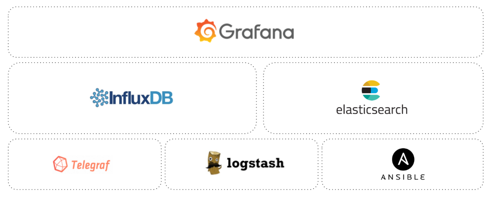

## monitor-portable

Dockerized stack monitoring system for general purposes. Intended to be small and portable.



Inputs:

- SNMP Poll/Traps
- IPFIX
- Syslog
- SSH/Netconf
- Telemetry / Google protocol buffer (in progress)

Containers:

- Telegraf: Polling agent
- Logstash: Procesing agent for syslog, IPFIX, etc
- InfluxDB: Modern time series database
- Elasticsearch: Modern Search-text engine
- Grafana: Multi-source visualization tool
- Ansible: Automation tool. In this case, for SSH/Netconf monitoring.

Pre-requisites:
- docker
- docker-compose

### Step 1: Install

```git clone https://github.com/lucasbritos/monitor-portable.git```

Execute first-time script for initial settings (see comments on file)

```bash first-time.sh``` 

### Step 2: Compose

```docker-compose up --no-start``` <br />
```docker-compose start``` <br />

### Step 3: Telegraf config

Add some telegraf config files at telegraf/conf.d folder <br />
You have some examples at telegraf/examples <br />
<br />
You need to restart telegraf each time you change config<br />
<br />
```docker-compose restart telegraf```<br />
<br />
Dont forget to configure snmp community on devices <br />

### Step 4: Grafana config

http://Server-IP:3000 <br />
Login: admin/admin (change password) <br />

Import some dashboards, you have some examples on grafana/dashboard_examples folder

### Step 5: Logstash config

Add some logstash config files at logstash/conf.d folder <br />
You have some examples at logstash/examples <br />
<br />
You DONT need to restart logstash each time you change config<br />
<br />
Dont forget to configure syslog towards UDP:1514 on devices<br />

### Step 6: Ansible playbooks

Add public key to devices to be monitored. asnible/keys/id_rsa.pub (generated on Step 1)

i.e Junos device

set system login user lbritos authentication load-key-file id_rsa.pub (you need to copy the file to the device)

Add Ansible playbooks to ansible/playbook folder.
Modify ansible/crontab file in order to control job schedule (No need to reboot Ansible container)

See some examples at ansible/examples

#### Useful commands

- docker-compose down -v (Delete all containers and volumes)
- iptables -I DOCKER-USER -i ext_if ! -s X.X.X.X/24 -j DROP (to add rule to avoid external exposure, DOCKER-USER chain shoulb be manually created before docker starts) 

#### TODO

- Configure Retention policies - Continous Querys on DB
- IPFIX Examples
